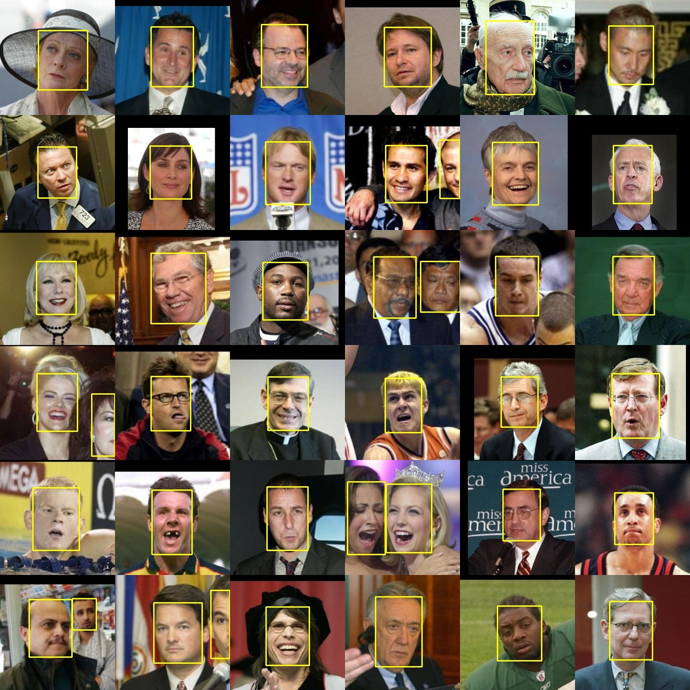

# Engagement Detection



This repository contains the source code for neural networks used in facial detection, emotion recognition,
and the overarching framework of engagement detection. 

The `facevideo.py` file contains live facial detection from the computer webcam. The comments
on the top of the file contain more information on usage of the different detectors. The `facedetect.py` also contains 
facial detection, however it detects faces from inputted images rather than a live video feed.

The repository also contains multiple convolutional neural networks for facial emotion recogition.
They are still in progress, but the general usage is as follows: Train the model from the `trainmodel.py` file,
and test the model using the `testmodel.py` file. 

**NOTE:** Before using anything in this repsitory, please visit the `data` directory and read the instructions
there on downloading any necessary files and the location of saved files.

## Installation

You can directly clone this repository from the command line:

```shell script
git clone https://github.com/amogh7joshi/fer.git
```

Or, if you have the GitHub CLI installed, you can use:

```shell script
gh repo clone amogh7joshi/engagement-detection
```

Enter the directory and install system requirements:
```shell script
# Enter Directory
cd fer

# Install System Requirements
python3 -m pip install -r requirements.txt
```

Then, use the scripts provided in the `scripts` directory to install the necessary data:
1. To install the model and caffemodel files for the DNN, use the `getdata.sh` script. 
2. Download the `fer2013.csv` file from [here](https://www.kaggle.com/deadskull7/fer2013), follow the directions in the `data`
 subdirectory.
3. Optionally, you can also download the `ck+` dataset from [here](https://www.kaggle.com/shawon10/ckplus), and follow the directions
in the `data` subdirectory.
4. Run the `preprocess.sh` script. It may take a couple of minutes.

For more information, visit the `data` subdirectory.

The `info.json` file contains the relevant locations of the cascade classifiers and DNN model files.
You can replace the current locations with those on your computer. 

## Usage

Currently, all models have been configured to work with the `fer2013` dataset. Integration with the `ck+` dataset is in progress.

**Model Training**: Run the `trainmodel.py` script. You can edit the number of epochs in the argparse argument
at the top of the file. Alternatively, you can run itt from the command line using the flags as mentioned by the 
argparse arguments. Model weights will be saved to the `data/model` directory, and at the completion of the training,
the best model will be moved into the `data/savedmodels` directory. The json file containing the model
architecture will also be saved there. You can control what models to keep in the `data/savedmodels` directory manually.

**Model Testing**: Run the `testmodel.py` script. You can edit which model weights and architecture you want to use at the 
location at the top of the file. From there, you can run `model.evaluate` on the pre-loaded training and testing data, 
you can run `model.predict` on any custom images you want to test, or run any other operations with the model. 
A confusion matrix is also present, which will display if `plt.show()` is uncommented.

**Face Detection**: Run the `facevideo.py` script. You can choose which detector you want to use, as described at the top of the file. 
If you want to save images, set the `-s` flag to `True`, and they will save to a custom directory at the top-level. 
More information is included at the top of the file. An implementation of the emotion detection model into this script
is currently in progress. 

## Neural Network Information

The model architecture I am currently using for the convolutional neural network is similar to that of VGG16 and VGG19 
[\[1\]](http://arxiv.org/abs/1409.1556). 

Since the model has a convolutional architecture, fully-connected layers have been replaced with a global average pooling layer. 
In general, it yields better results. The 2-D convolution layers can also be replaced with separable 2-D convolution layers,
although regular convolution layers seem to yield better results with the image sizes of the `fer2013` dataset.

The deep neural network for face detection makes use of a pre-trained model using the  ResNet architecture 
[\[2\]](http://arxiv.org/abs/1512.03385).

## Data Pipelines

The directories in this repository are integrated for a seamless transition sequence. All necessary data
including model architecture, weights, cascade classifiers, and other necessary files will be saved to necessary 
subdirectories in the `data` directory. *Please visit the `data` directory for usage instructions.*

## License and Contributions

The code in this repository is available under the [MIT License](https://github.com/amogh7joshi/fer/blob/master/LICENSE). Although you are welcome to download the 
repository and work with it, unfortunately no contributions will be accepted. 

## References

[1]: Simonyan, K., and Zisserman, A. (2015). Very deep convolutional networks for large-scale image recognition. ArXiv:1409.1556 [Cs]. http://arxiv.org/abs/1409.1556

[2]: He, K., Zhang, X., Ren, S., & Sun, J. (2015). Deep residual learning for image recognition. ArXiv:1512.03385 [Cs]. http://arxiv.org/abs/1512.03385